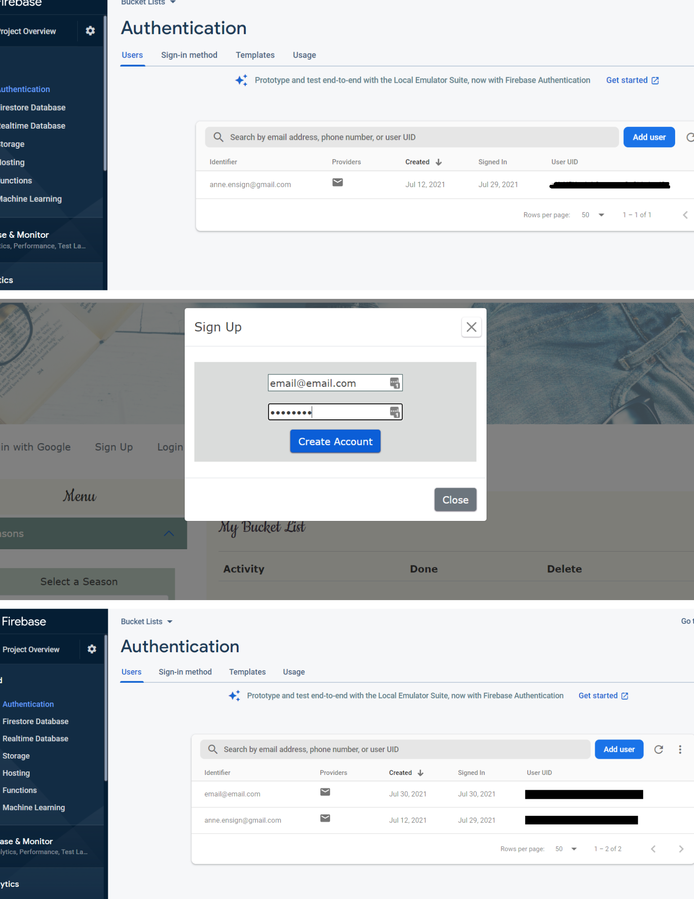

# Seasonal "Bucket Lists"
Project by Anne Ensign

## Note For Mentor:
You will not be able to run this project locally since it is hosted by Firebase and deployed on a live page. 

Please review my code in the "Public" files and note the features listed below that meet requirements.

Then, visit my webpage to verify the features are working: 
https://bucket-lists-47294.web.app

## About:
This project is for Code Louisville's JavaScript Class, Summer 2021.

Every summer, my stepsister and her family put together a "Summer Bucket List." She, her husband and four kids brainstorm all the fun things they want to do, write it out and check them off as they complete them. 

Inspired to have more fun and enjoy being "in the moment," my family made our own list for this summer with pen to paper. Then I thought, "Why stop there?"

This is an app to make customizable, printable lists for all seasons. Included are some generated activities to add, but users can write in their own as well. 


### Special Instructions:
- Firebase securities will not allow anyone to run or edit this file without my authorization. 

### Project Requirements Met:
- Responsive Design
  - Layout changes to grid on large screens.
- At least 5 commits in Git.
- At least 3 features as listed in the syllabus.

### Features:
1. Retrieve data from an external API.
     - Random activity generator with [Bored API](https://www.boredapi.com) in "Find a Random Activity."  
     From app.js:

     ```javascript
     function requestListener() {
          const data = JSON.parse(this.responseText);
          console.log(data);
      }

      function requestError(error) {
          console.log('Fetch Error :-S', error);
      }

      const activityRequest = new XMLHttpRequest();
      activityRequest.onload = requestListener;
      activityRequest.onerror = requestError;
      activityRequest.open('GET', 'https://www.boredapi.com/api/activity?type=recreational', true);
      activityRequest.send();

      randomButton.addEventListener('click', ()=> {
          fetch('https://www.boredapi.com/api/activity?type=recreational')
          .then(
              function(response) {
              if (response.status !== 200) {
                  console.log('Looks like there was a problem. Status Code: ' +
                  response.status);
                  return;
              }

              // Examine the text in the response
              response.json().then(function(data) {
                  console.log(data.file);
                  randomActivity.innerHTML = data.activity;
              });
              }
          )
          .catch(function(error) {
              console.log('Fetch Error :-S', error);
          });
      });

      randomAddToListButton.addEventListener('click', () => {
          createListItem(randomActivity.textContent); 
      });
     ```
2. Create an array and populate it with multiple values, display it in the application.
     - Multiple arrays in js folder, modules imported to "app.js."
     - Node.JS reads the modules.
     - New "Activity Suggestions" appear depending on the season selected. 
     Example, fall list module in fall.js:

     ```javascript
     export const fallList = [
       "Make Candied Apples",
       "Eat Pumpkin Pie",
       "Hay Ride",
       "Make Apple Cider",
       "Watch a Scary Movie",
       "U-Pick Pumpkins",
       "Take a Ghost Tour",
       "Jump into a Pile of Leaves",
       "Knit a Scarf",
       "Go to a Football Game"
   ];
     ```
     and the imports at the top of app.js:
     
     ```javascript
      import { xmasList } from "./xmas.js";
      import { winterList } from "./winter.js";
      import { springList } from "./spring.js";
      import { summerList } from "./summer.js"
      import { fallList } from "./fall.js";
      import { activityAnySeason } from "./anytime.js";
      ```

3. Calculate and display data based on an external factor (ex: get the current date, and display how many days remaining until some event).
     - When "Christmas" is chosen for the season, a countdown clock appears in the header telling the user how many days until Christmas
     In app.js:
     ```javascript
     function xmasCountdown() {
         const today = new Date();
         const daysUntilXMas = new Date(2021, 11, 25, 0, 0, 0, 0); // Set day and month
         daysUntilXMas.setFullYear(today.getFullYear()); // Set year to this year
         const msPerDay = 24 * 60 * 60 * 1000; // Number of milliseconds per day
         let daysLeft = (daysUntilXMas.getTime() - today.getTime()) / msPerDay;
         daysLeft = Math.round(daysLeft); //returns days left in the year
         return daysLeft + " Days Until Christmas!";
     }
     ```
4. Other:
     - Firebase: Initialized Firebase the project for users to create profiles.
       - If a user makes an account, it will appear in my Firebase console.
       - Check out the auth.js file to view various authentication code. 
     Screenshots:

     

     - Special printing that only displays header, Bucket List area and checkboxes.